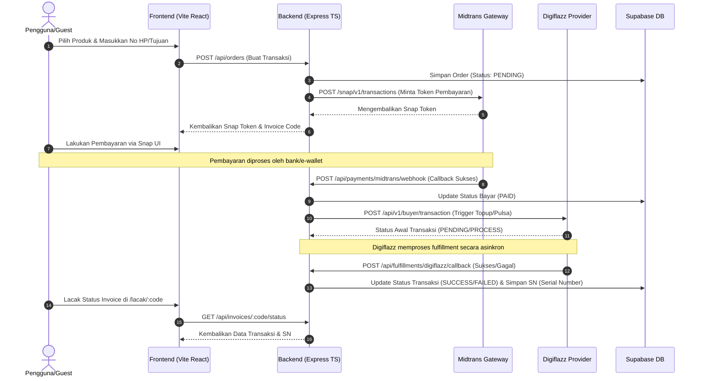

# 🚀 DEVELOPER HANDOFF & RUNBOOK
## Adnanpay PPOB Payment Platform

Selamat datang di repositori utama **Adnanpay PPOB Platform**! Dokumen ini dibuat khusus untuk memudahkan Anda (dan developer setelah Anda) melanjutkan pengembangan, melakukan pemeliharaan, serta menyebarkan (*deploy*) sistem dengan cepat dan aman.

Sistem ini adalah platform PPOB (*Payment Point Online Bank*) berbasis **Vite + React (Frontend)** dan **Node.js Express + TypeScript (Backend)**, yang terintegrasi dengan **Supabase (Database/Auth/RLS)**, **Midtrans (Payment Gateway)**, dan **Digiflazz (Product Fulfillment)**.

---

## 📂 Peta Navigasi Direktori (Directory Roadmap)

Repositori ini telah dibersihkan dan dirapikan dari berbagai berkas sementara (*temporary*), *scraper*, dan *backup*. Berikut adalah struktur folder fungsional saat ini:

| Folder / Berkas | Tipe | Deskripsi & Kegunaan |
| :--- | :---: | :--- |
| [`backend/`](file:///d:/coding/1.PPOB%20PAYMENT/backend) | Folder | Kode sumber backend Node.js + Express + TypeScript. Mengelola API, Webhooks, Layanan Email, dan Integrasi Pihak Ketiga. |
| [`Frontend/`](file:///d:/coding/1.PPOB%20PAYMENT/Frontend) | Folder | Kode sumber frontend utama menggunakan React, Vite, TypeScript, dan Tailwind CSS. |
| [`next-frontend/`](file:///d:/coding/1.PPOB%20PAYMENT/next-frontend) | Folder | Folder Next.js frontend (cadangan/pengembangan masa depan jika direncanakan beralih ke Next.js). |
| [`supabase/`](file:///d:/coding/1.PPOB%20PAYMENT/supabase) | Folder | Konfigurasi local Supabase CLI dan berkas database migrations (`migrations/`). |
| [`docs/`](file:///d:/coding/1.PPOB%20PAYMENT/docs) | Folder | Kumpulan panduan teknis mendalam (integrasi Digiflazz, SMTP email cPanel, runbook, dan arsitektur). |
| [`mcp/`](file:///d:/coding/1.PPOB%20PAYMENT/mcp) | Folder | Server MCP *TestSprite* adnanpay untuk automasi pengujian fungsionalitas sistem. |
| [`.env.example`](file:///d:/coding/1.PPOB%20PAYMENT/.env.example) | Berkas | Template variabel lingkungan (*environment variables*) global. |
| [`ARCHITECTURE.md`](file:///d:/coding/1.PPOB%20PAYMENT/ARCHITECTURE.md) | Berkas | Dokumentasi arsitektur sistem, skema database, keamanan URL, dan modul program. |
| [`DEPLOYMENT.md`](file:///d:/coding/1.PPOB%20PAYMENT/DEPLOYMENT.md) | Berkas | Panduan lengkap langkah demi langkah deployment ke server produksi cPanel. |

---

## ⚙️ Cara Menjalankan Proyek di Lingkungan Lokal (Local Development)

### Prasyarat
* Node.js v20 atau lebih baru.
* Akun / Proyek Supabase aktif.

### 1. Inisialisasi Environment Variables
Salin berkas template `.env.example` menjadi `.env` di folder root, lalu isi nilai-nilainya:
```bash
cp .env.example .env
```
Lakukan hal yang sama untuk folder `backend/` dan `Frontend/`:
* `backend/.env` (Gunakan `.env.example` di dalam `backend/` sebagai acuan)
* `Frontend/.env.production` (Untuk build produksi frontend)

### 2. Instalasi Dependensi & Menjalankan Aplikasi
Buka terminal baru untuk masing-masing perintah berikut:

**Backend (Port 3001 secara default):**
```bash
# Masuk ke folder backend, instal dependensi, dan jalankan dev server
npm --prefix backend install
npm --prefix backend run dev
```

**Frontend (Port 5173 secara default):**
```bash
# Masuk ke folder Frontend, instal dependensi, dan jalankan dev server
npm --prefix Frontend install
npm --prefix Frontend run dev
```

Buka peramban (*browser*) Anda dan akses `http://localhost:5173` untuk melihat antarmuka.

---

## 🔒 Arsitektur Integrasi Utama & Aliran Data

Aplikasi ini menggunakan integrasi asinkronus yang kuat untuk memastikan keamanan transaksi:



---

## 📦 Panduan Deployment Produksi (cPanel / Natanetwork)

Sistem ini didesain agar kompatibel dengan **Node.js App (Passenger)** di cPanel tanpa membutuhkan akses `sudo`, PM2, atau *systemd*.

### Ringkasan Langkah Penyebaran:
1. **Lakukan Build Lokal**:
   * Build Backend: `npm --prefix backend run build` (menghasilkan folder `backend/dist`).
   * Build Frontend: `npm --prefix Frontend run build` (menghasilkan folder `Frontend/dist`).
2. **Unggah Berkas Frontend**:
   * Unggah isi folder `Frontend/dist/*` langsung ke folder `/home/adnanpay/public_html` di cPanel agar menjadi halaman web statis utama di domain `https://adnanpay.com`.
3. **Unggah Berkas Backend**:
   * Transfer folder `backend/` (termasuk folder `dist` hasil kompilasi, `node_modules`, `package.json`, dll.) ke direktori backend cPanel (misal `/home/adnanpay/ppob-backend`).
4. **Konfigurasi Application Manager (cPanel)**:
   * Arahkan *Application Root* ke folder backend Anda (`ppob-backend`).
   * Atur *Application Startup File* ke `dist/index.js`.
   * Atur *Environment Variables* utama di UI Node.js cPanel (terutama `SUPABASE_SERVICE_ROLE_KEY`, `MIDTRANS_SERVER_KEY`, dan `DIGIFLAZZ_API_KEY`).
5. **Restart Backend**:
   * Klik tombol **Restart** pada cPanel Node App UI, atau jalankan perintah `touch /home/adnanpay/ppob-backend/tmp/restart.txt` di server.

> [!NOTE]
> Hubungan Endpoint Webhook Utama di Produksi:
> * **Midtrans Webhook Callback**: `https://adnanpay.com/api/payments/midtrans/webhook`
> * **Digiflazz Callback URL**: `https://adnanpay.com/api/fulfillments/digiflazz/callback`

---

## 👥 Akun Demo untuk Pengujian (Demo Accounts)

Untuk tujuan evaluasi dan pengembangan lokal/staging, berikut adalah daftar akun demo yang telah terdaftar di database Supabase:

| Peran (Role) | Alamat Email | Kata Sandi | Fitur Khusus |
| :--- | :--- | :--- | :--- |
| **Admin** | `admin@adnanpay.com` | `Admin123!@#` | Mengakses dashboard admin di `/demo/admin`, memantau semua pesanan, mengelola markup harga, mengimpor katalog produk via Excel, dan mengirim email alerts. |
| **Reseller** | `reseller@adnanpay.com` | `Reseller123!` | Mengakses dashboard reseller di `/demo/dashboard`, menikmati harga produk reseller yang lebih murah, memantau riwayat transaksi, komisi, dan meminta pencairan saldo (*payout*). |
| **Affiliate** | `affiliate@adnanpay.com` | `Affiliate123!` | Mengakses dashboard di `/demo/dashboard`, mengelola kode referal, dan memantau komisi referal. |
| **Guest/Member** | - | - | Pengguna umum yang dapat melakukan checkout langsung dari halaman utama tanpa memerlukan akun. |

---

## 📈 Rencana Kerja Selanjutnya (Next Development Steps)

Berikut adalah beberapa pekerjaan prioritas yang direkomendasikan untuk diselesaikan di fase berikutnya:
1. **Migrasi Database Produksi**: Saat ini migrasi database masih menggunakan awalan nama tabel `demo_` untuk isolasi pengujian. Saat meluncurkan ke produksi, hapus awalan `demo_` di konfigurasi database utama atau jalankan migrasi produksi bersih.
2. **Penerapan Route Guards di Frontend**: Batasi rute `/dashboard` dan `/admin` di tingkat aplikasi React agar mengarahkan kembali pengguna yang belum terautentikasi (*unauthorized*) ke halaman login.
3. **Pengujian Layanan Email (SMTP)**: Lakukan pengujian pengiriman email notifikasi transaksi (seperti verifikasi akun atau status sukses pembayaran) menggunakan SMTP ril dari cPanel mail server.
4. **Verifikasi Webhook Midtrans & Digiflazz**: Simulasikan callback sukses dari instrumen sandbox Midtrans dan respons sukses dari provider Digiflazz untuk memastikan status invoice diperbarui secara *realtime* di database.
