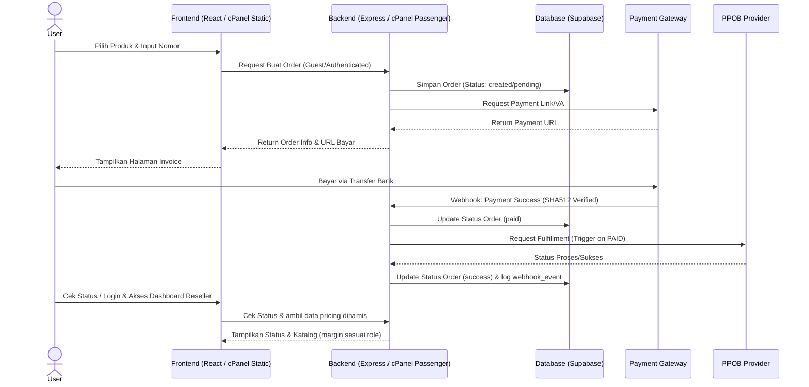
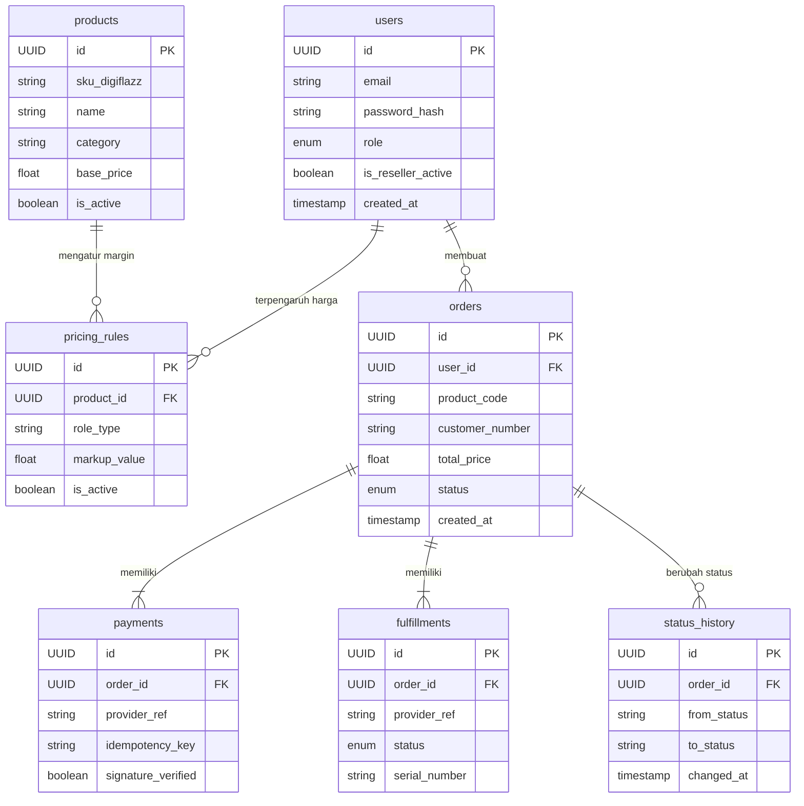

b# PRD — Project Requirements Document

## 1. Overview
Adnanpay PPOB Web saat ini telah mencapai tahap **MVP Fungsional** dengan alur transaksi inti yang sudah berjalan penuh. Aplikasi sudah mampu menangani guest checkout, inisialisasi pembayaran Midtrans, verifikasi webhook, fulfillment otomatis via Digiflazz, serta halaman status invoice real-time. Fokus proyek lanjutan ini bukan membangun dari nol, melainkan **menyempurnakan dan mengembangkan** sistem yang sudah ada menjadi platform berjenjang yang mendukung manajemen katalog produk, otentikasi multi-peran, dan skema harga dinamis untuk reseller. 

Tujuan utama adalah mengintegrasikan fitur login/registrasi, Role-Based Access Control (RBAC) untuk Admin, Seller (Reseller), dan Pengguna, serta engine margin harga otomatis. Arsitektur akan mempertahankan stack teknologi yang sudah terbukti stabil (Vite React, Express Node.js, Supabase) dan di-deploy ke lingkungan cPanel shared hosting (`adnan-natanetwork`) dengan pendekatan stateless sesuai batasan akses user-level tanpa root.

## 2. Requirements
- **Penyempurnaan MVP Existing**: Meneruskan dan mengoptimalkan kode frontend (React/Vite/TS) dan backend (Express/TS) yang sudah memiliki modul order, payment, fulfillment, invoice, audit, serta rate limit.
- **Ekspansi Fitur Otentikasi & RBAC**: Menambahkan sistem login/register, manajemen session berbasis JWT, dan middleware proteksi rute berdasarkan peran (`admin`, `seller`, `pengguna`).
- **Manajemen Harga & Katalog Dinamis**: Mengembangkan sistem pricing yang membaca harga dasar Digiflazz, lalu menerapkan markup/margin berdasarkan role pengguna. Admin dapat mengelola katalog dan margin secara global atau per produk via dashboard.
- **Optimasi Deployment & Security**: Menyesuaikan alur deployment dengan karakteristik cPanel/Passenger, memisahkan credential production, dan menyiapkan mekanisme verification gate sebelum live staging/production.
- **Dashboard UI**: Menyediakan panel admin untuk manajemen harga/produk/log transaksi dan panel member untuk riwayat transaksi serta pengelolaan status akun reseller.

## 3. Core Features
### ✅ Fitur Tervalidasi & Sudah Ada (MVP Base)
- **Guest Checkout & Order Management**: Alur pembelian tanpa login, pembuatan invoice, tracking status pesanan, dan idempotency handling.
- **Integrasi Pembayaran Midtrans**: Inisialisasi transaksi, verifikasi signature SHA512 webhook, handling replay attack, dan logging event.
- **Otomatisasi Fulfillment Digiflazz**: Trigger pengiriman pulsa/data saat status `PAID`, callback handling, mock fallback untuk development.
- **Halaman Status Invoice**: Endpoint dan UI `/invoice/:code` untuk tracking real-time status pembayaran & pengiriman.
- **Keamanan Dasar**: Audit logging terstruktur, rate limiting middleware, health check endpoint.
- **Database Schema Transaksional**: Tabel `orders`, `payments`, `fulfillments`, `webhook_events`, `status_history` dengan isolasi dev via prefix `demo_`.

### 🚀 Fitur Pengembangan Lanjutan (Next Phase)
- **Otentikasi & Manajemen Akun**: Login/Register (email/password), reset password, manajemen profil, tombol "Upgrade ke Reseller".
- **Role-Based Access Control (RBAC)**: Middleware proteksi rute berdasarkan role. UI dan pricing catalog berubah otomatis sesuai status akun.
- **Multi-Harga Dinamis Reseller**: Engine pricing yang menghitung harga jual (`base_price + markup[role]`). Harga Reseller menggunakan margin yang lebih rendah daripada Pengguna Biasa, mencerminkan ambil margin admin master.
- **Dashboard Admin**: UI khusus untuk admin: CRUD produk/katalog, atur margin global/per produk, pantau transaksi & webhook logs, toggle status produk, serta approve/manage akun reseller.
- **Dashboard Member/Reseller**: UI khusus: riwayat transaksi, filter status, status akun reseller aktif/nonaktif, dan informasi keuntungan margin.
- **Manajemen Katalog Produk**: Sinkronisasi atau manual input produk dari Digiflazz, kategori, status aktif/nonaktif, dan batas harga jual.

## 4. User Flow
1. **Eksplorasi (Guest / Pengguna Baru)**: Pengguna membuka web, melihat daftar harga kompetitif, dan melihat banner/promo "Daftar Reseller untuk Harga Lebih Murah". Melakukan checkout tanpa login, bayar via Midtrans, pulsa otomatis terkirim, cek status di halaman invoice.
2. **Registrasi & Login**: Pengguna klik "Sign In / Daftar", masuk akun. Status awal: `pengguna`. Dashboard member muncul dengan riwayat transaksi.
3. **Upgrade ke Reseller**: User klik "Daftar Jadi Reseller". Admin bisa auto-approve atau manual. Status kolom `role` berubah ke `seller`.
4. **Transaksi Reseller**: Saat seller login, katalog produk otomatis menampilkan harga modal yang lebih murah. Seller checkout, bayar, dan sistem fulfillment berjalan sama. Profit tersimpan dari selisih harga jual kepada下游 customer vs harga modal internal.
5. **Admin Management**: Admin login ke `/admin`. Mengatur harga basic Digiflazz, menambah/markup margin untuk role `pengguna` dan `seller` secara terpisah, kelola user (promote/demote), monitor log transaksi, webhook, dan status produk.

## 5. Architecture
Sistem menggunakan arsitektur **Client-Server API-based** dengan frontend statis dan backend stateless, dijalankan pada lingkungan cPanel shared hosting (`adnan-natanetwork`) tanpa akses root. Struktur project mengikuti pola monorepo lokal yang sudah terbentuk dan siap diintegrasikan.

### Struktur Monorepo Existing
```text
/backend/          # Express + TS. Modular: order, payment, fulfillment, invoice, security, routes, tests
/Frontend/         # Vite + React + TS + Tailwind. Routing: Home, InvoiceStatusPage, components
/supabase/         # Config, migrations, RLS policies
/deploy-adnanpay/  # Artefak build lokal untuk staging/transfer ke server
```

### Arsitektur Deployment cPanel (Passenger)
- **Frontend (Vite React)**: Di-build lokal (`npm run build`) menjadi aset statis. Hasil folder `dist/` ditempatkan di `/home/adnanpay/public_html/` atau subfolder seperti `public_html/app/`. Passenger/Apache bertugas melayani file statis. Konfigurasi routing SPA diatur via `.htaccess` atau Passenger rewrite rules agar fallback ke `index.html` berfungsi.
- **Backend (Express Node.js)**: Dijalankan via **cPanel Setup Node.js App**. Aplikasi bind ke internal port yang dialokasikan otomatis oleh CloudLinux Passenger. HTTP request dari port 80/443 di-proxy ke aplikasi. Manajemen proses (start/stop/restart) dilakukan via UI cPanel. PM2/systemd tidak digunakan karena batasan akses user-level.
- **Keterhubungan**: Frontend membaca `VITE_API_BASE_URL` (public proxy URL). Backend membaca env vars dari cPanel. Webhook Midtrans/Digiflazz diarahkan ke backend public URL yang di-proxy cPanel.
- **Database**: Supabase PostgreSQL eksternal. Backend menggunakan `@supabase/supabase-js` dengan connection pooling alami. Tidak ada database lokal di cPanel untuk mengurangi beban I/O dan memory.



**Catatan Arsitektur:**
- Webhook Midtrans & Digiflazz harus CORS-friendly dan dialamatkan ke endpoint backend yang di-proxy Passenger.
- Backend stateless, cocok untuk shared hosting. Timeout request Digiflazz diketatkan (max 10-15s) untuk mencegah resource exhaustion.
- Isolasi Dev/Prod menggunakan `SUPABASE_TABLE_PREFIX` (`demo_` untuk dev, kosong untuk prod).

## 6. Database Schema
Skema diadaptasi dari migration Supabase yang sudah direalisasikan, dengan penambahan kebutuhan untuk RBAC dan pricing dinamis di fase lanjutan.

### Tabel Utama (Sudah Ada & Tervalidasi)
- **`orders`**: Menyimpan transaksi. `id` (UUID), `user_id` (nullable guest), `product_code`, `customer_number`, `total_price`, `status` (`created`, `pending_payment`, `paid`, `fulfillment_pending`, `success`, `failed`, `expired`), `created_at`.
- **`payments`**: Menyimpan detail pembayaran Midtrans. `id`, `order_id`, `provider_ref`, `idempotency_key`, `status`, `signature_verified`. Unique index pada `provider_ref` untuk mencegah duplikasi webhook.
- **`fulfillments`**: Menyimpan log pengiriman Digiflazz. `id`, `order_id`, `provider_ref`, `attempts`, `status`, `serial_number`, `payload_response`.
- **`webhook_events`**: Menyimpan audit event dari provider. `id`, `provider`, `event_type`, `payload`, `processed_status`.
- **`status_history`**: Timeline perubahan status order. `id`, `order_id`, `from_status`, `to_status`, `changed_at`.

### Tabel Baru (Untuk Ekspansi Fitur)
- **`users`**: `id` (UUID), `email`, `password_hash`, `role` (`pengguna`, `seller`, `admin`), `display_name`, `is_reseller_active` (boolean), `created_at`, `updated_at`.
- **`products`**: `id`, `sku_digiflazz`, `name`, `category`, `base_price` (harga modal Digiflazz), `is_active`, `synced_at`.
- **`pricing_rules`**: `id`, `product_id` (nullable untuk global rule), `role_type`, `markup_fixed` atau `markup_percentage`, `is_active`. Menentukan margin yang ditambahkan ke `base_price` berdasarkan role.



## 7. Tech Stack
Stack teknologi telah dioptimalkan untuk lingkungan cPanel `adnan-natanetwork`, mematuhi batasan akses user-level, dan memanfaatkan kode yang sudah ada.

### Stack Utama
- **Frontend**: React 18 + Vite + TypeScript + Tailwind CSS. Dibuild sebagai *Static Site* untuk cPanel. Routing client-side dengan fallback config. Komponen UI modular dengan `lucide-react`.
- **Backend**: Node.js + Express.js + TypeScript. Modular architecture (`src/modules/...`). Dijalankan via **cPanel Node.js App Manager (Passenger)**. TypeScript digunakan secara ketat untuk type safety di layer service, repository, dan router.
- **Database**: Supabase (PostgreSQL). Digunakan karena tidak memerlukan database lokal, mendukung connection pooling, dan menyediakan migration CLI yang sudah terintegrasi. **Supabase Service Role Key hanya dikonsumsi oleh backend**, tidak pernah diekspos ke frontend atau public env.
- **Otentikasi**: Custom JWT-based authentication dengan `bcrypt`/`argon2` untuk hashing password. Middleware Express memeriksa token dan role dalam setiap request terproteksi.
- **Testing**: Jest & Supertest untuk backend (unit, integration, regression). Vitest & Testing Library untuk frontend (smoke test, component render). Coverage mencakup happy path, webhook idempotency, pricing engine, dan RBAC middleware.
- **Eksternal API**: Midtrans (Snap/VA API + Webhook SHA512), Digiflazz (REST API untuk checkout & status).

### Keterbatasan & Optimasi Infrastruktur
| Komponen | Batasan cPanel / Risiko | Strategi Optimasi & Solusi |
|----------|------------------------|----------------------------|
| **Akses Root / Sudo** | Tidak ada (`read-only user`) | Tidak menggunakan PM2, systemd, cron daemon. Management proses mengandalkan UI cPanel Node.js App. |
| **Resource (CPU/RAM)** | Shared hosting limit | Backend stateless. DB connection pool pendek. Timeout Digiflazz dibatasi 10-15s. Hindari operasi berat di request handler. |
| **Deployment Frontend** | Tidak ada dev server runtime | Build lokal → upload `dist/` ke `public_html`. Konfigurasi `.htaccess` atau Passenger routing untuk SPA fallback. |
| **Environment Variables** | cPanel UI / `.env` file | Variable produksi diatur via cPanel "Environment Variables" atau file `.env` yang di-exclude di `.gitignore`. Tidak ada secret di frontend. |
| **Database Secret** | Supabase Service Role Key | Hanya disimpan di backend env. Frontend hanya berkomunikasi via backend API proxy untuk keamanan data harga & transaksi. |

## 8. Deployment & Verification Gate
Sebelum aplikasi dideploy penuh ke production `adnan-natanetwork`, proses penyempurnaan harus melewati gerbang verifikasi (verification gates) berikut:

### 8.1 Validasi Runtime cPanel
- Pastikan Node.js versi stabil (LTS) tersedia dan dapat dipilih via cPanel.
- Verifikasi fitur **Setup Node.js App** dapat membuat aplikasi, menentukan startup file (hasil build TS: `dist/index.js`), dan menetapkan application URL.
- Uji koneksi Passenger dengan endpoint `/health` untuk memastikan proxy berjalan lancar dan middleware rate-limit tidak memblokir request lokal/internal.

### 8.2 Keamanan & Isolasi Secret
- Audit semua file `.env*` dan dokumentasi internal. Pastikan `MIDTRANS_SERVER_KEY`, `DIGIFLAZZ_API_KEY`, `SUPABASE_SERVICE_ROLE_KEY`, dan `JWT_SECRET` tidak masuk ke version control.
- Konfigurasi environment variables secara eksklusif melalui panel cPanel atau file `.env` yang hanya di-deploy ke direktori backend.
- Terapkan RLS (Row Level Security) di Supabase sebagai lapisan keamanan tambahan, meskipun backend sudah menangani otorisasi JWT.

### 8.3 Alur Build & Upload
1. **Backend**: `cd backend && npm run build` → hasil ke artefak → upload ke struktur Node.js App cPanel via File Manager/FTP.
2. **Frontend**: `cd Frontend && npm run build` → hasil `dist/` → upload ke `/home/adnanpay/public_html/` (atau subfolder target).
3. **Database**: Jalankan migration Supabase terbaru yang mencakup tabel `users`, `products`, `pricing_rules`, serta tabel transaksional existing. Pastikan prefix `demo_` dinonaktifkan/switch ke schema production.

### 8.4 Verification Gates Checklist
- [ ] Lint & Typecheck lulus tanpa error blocking (`npm run lint`, `npm run typecheck`).
- [ ] Test suite lulus dengan coverage minimum 75% untuk core modules (payment, fulfillment, pricing, auth).
- [ ] Webhook Midtrans & Digiflazz dapat diproses backend tanpa error 500, signature/ID validation & idempotency aktif.
- [ ] Multi-pricing engine berfungsi: Pengguna melihat harga markup X, Seller melihat markup Y (lebih rendah) sesuai konfigurasi `pricing_rules`.
- [ ] RBAC middleware memblokir akses rute `/admin` dan `/dashboard` jika role tidak sesuai atau token tidak valid.
- [ ] Deployment artifact teruji di staging cPanel, restart via cPanel UI berfungsi tanpa downtime kritis atau broken proxy.
- [ ] Domain/Subdomain produksi aktif dan SSL/HTTPS valid untuk webhook callback URL (Midtrans & Digiflazz mewajibkan HTTPS).

## Ringkasan Status Proyek
Aplikasi telah mencapai fase **MVP Fungsional** dengan pondasi teknis yang solid dan alur transaksi inti yang sudah teruji. PRD ini direvisi untuk menutup celah antara sistem guest checkout yang berjalan dengan kebutuhan bisnis platform berjenjang (reseller). Fokus utama adalah integrasi RBAC, engine pricing dinamis berbasis margin, dan penyesuaian deployment akhir ke lingkungan cPanel tanpa root, memastikan sistem siap produksi dengan keamanan, stabilitas, dan skalabilitas yang sesuai untuk Adnanpay PPOB Web.