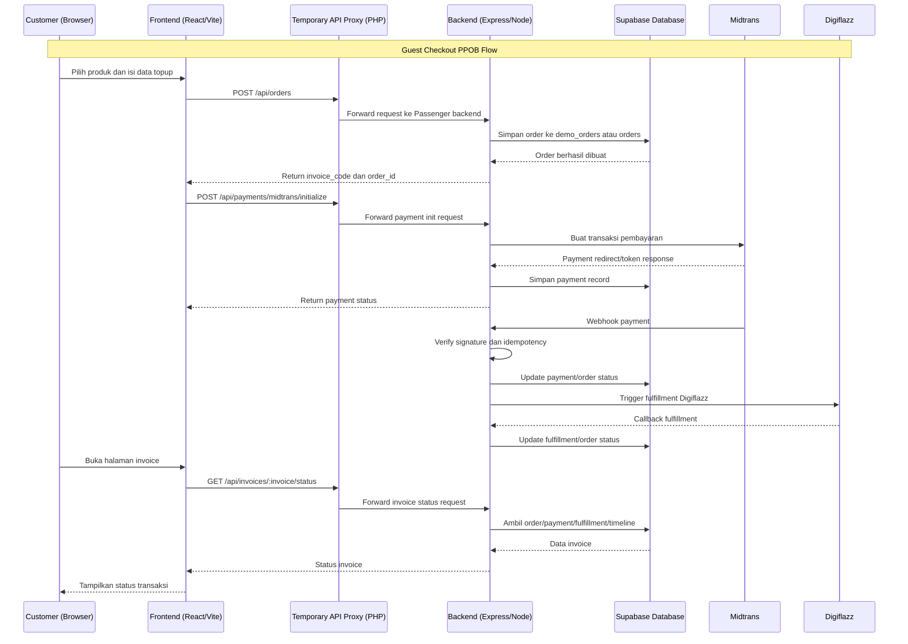
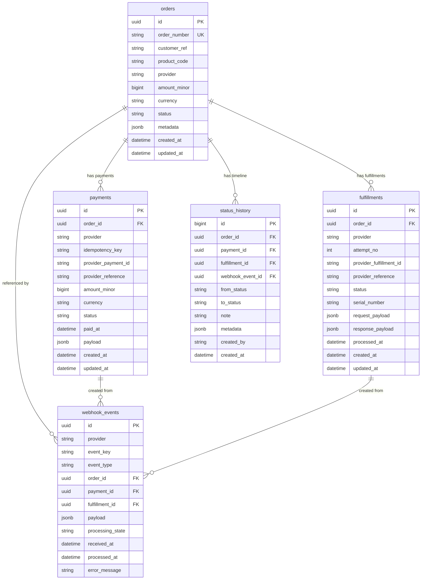

# PRD — Adnanpay PPOB Web

## 1. Overview

Aplikasi ini bertujuan untuk menyediakan platform web PPOB/topup digital bernama **Adnanpay**. Masalah utama yang ingin diselesaikan adalah proses topup manual yang sulit dilacak, rawan salah status pembayaran, dan belum memiliki alur invoice yang jelas untuk pelanggan.

Tujuan utama aplikasi adalah menyediakan sistem berbasis web yang memungkinkan pelanggan melakukan topup tanpa login terlebih dahulu (**guest checkout**), membayar melalui Midtrans, lalu memantau status invoice sampai transaksi selesai. Sistem juga terhubung ke Digiflazz untuk fulfillment produk digital dan memakai Supabase sebagai database transaksi.

Saat ini aplikasi masih berada pada tahap MVP development. Fitur manajemen user, login member, dashboard admin, dan product management belum termasuk dalam versi yang sudah berjalan.

## 2. Requirements

Berikut adalah persyaratan tingkat tinggi untuk pengembangan sistem:

- **Aksesibilitas:** Aplikasi harus dapat diakses melalui web browser desktop maupun mobile.
- **Mode Checkout:** Sistem harus mendukung guest checkout tanpa login.
- **Pembayaran:** Sistem harus dapat membuat pembayaran melalui Midtrans sandbox/development dan siap diarahkan ke production.
- **Fulfillment:** Sistem harus mendukung Digiflazz callback dan mock fallback pada mode development.
- **Status Invoice:** Pelanggan harus dapat membuka halaman invoice untuk memantau status order.
- **Database Separation:** Data development/demo harus terpisah dari data production.
- **Deployment:** Aplikasi harus bisa berjalan pada cPanel/CloudLinux user tanpa Docker dan tanpa akses root.
- **Security:** Secret tidak boleh masuk Git. Webhook harus diverifikasi signature dan idempotent.
- **Domain:** Sistem sementara harus bisa berjalan tanpa domain menggunakan cPanel temporary URL, tetapi production final membutuhkan domain/subdomain aktif.

## 3. Core Features

Fitur-fitur kunci yang ada dalam MVP saat ini:

1. **Frontend PPOB / Topup Page**
   - Menampilkan landing page dan katalog produk/topup.
   - Pelanggan dapat memilih produk dan mengisi data tujuan topup.
   - Frontend berjalan sementara di cPanel temporary path.

2. **Guest Checkout**
   - Pelanggan membuat order tanpa login.
   - Backend membuat invoice code dan order ID.
   - Order awal masuk status `pending_payment`.

3. **Midtrans Payment Integration**
   - Backend membuat payment initialization.
   - Callback/webhook Midtrans diverifikasi dengan signature.
   - Callback replay harus idempotent dan tidak membuat duplicate payment.
   - Invalid signature tidak boleh mengubah data transaksi.

4. **Digiflazz Fulfillment**
   - Order paid dapat diteruskan ke fulfillment.
   - Callback Digiflazz mengubah status fulfillment/order secara idempotent.
   - Mode development dapat memakai mock fallback.
   - Mode production harus menolak mock fallback jika credential tidak lengkap.

5. **Invoice Status Page**
   - Pelanggan dapat membuka status invoice.
   - Status menampilkan payment, fulfillment, dan timeline transaksi.
   - Sistem mendukung polling sampai status terminal seperti `success`, `failed`, atau `expired`.

6. **Development Database Isolation**
   - Production memakai tabel utama.
   - Development/demo memakai tabel dengan prefix `demo_`.
   - Backend memilih tabel berdasarkan env `SUPABASE_TABLE_PREFIX`.

7. **Security & Audit**
   - Rate limit pada endpoint sensitif.
   - Audit log untuk signature failure dan security rejection.
   - Supabase RLS service-role only.
   - `.env` dan secret file tidak boleh masuk Git.

## 4. User Flow

Alur kerja pelanggan saat menggunakan aplikasi:

1. **Buka Halaman Topup:** Pelanggan membuka web Adnanpay PPOB.
2. **Pilih Produk:** Pelanggan memilih produk/topup yang tersedia.
3. **Isi Data Tujuan:** Pelanggan memasukkan data tujuan seperti customer ID, zone ID, dan email jika diperlukan.
4. **Checkout:** Frontend mengirim request create order ke backend.
5. **Invoice Dibuat:** Backend menyimpan order dan mengembalikan invoice code.
6. **Pembayaran:** Frontend meminta Midtrans payment initialization dan menampilkan status pembayaran.
7. **Webhook Payment:** Midtrans mengirim callback ke backend. Backend memverifikasi signature dan mengubah status payment/order.
8. **Fulfillment:** Backend memproses fulfillment Digiflazz atau mock development.
9. **Cek Invoice:** Pelanggan membuka halaman invoice untuk melihat status akhir.

Alur kerja development saat ini:

1. Developer membuka temporary URL cPanel.
2. Frontend memanggil temporary API proxy.
3. Proxy meneruskan request ke backend Passenger.
4. Backend berjalan dengan `NODE_ENV=development` dan `SUPABASE_TABLE_PREFIX=demo_`.
5. Semua order demo masuk ke tabel `demo_orders`, bukan `orders` production.

## 5. Architecture

Berikut adalah gambaran arsitektur sistem dan aliran data secara teknis namun sederhana:



## 6. Database Schema

Berikut adalah Entity Relationship Diagram (ERD) yang menggambarkan struktur database utama:



| Tabel | Deskripsi |
|-------|-----------|
| **orders** | Data utama order/invoice pelanggan |
| **payments** | Data pembayaran Midtrans dan status payment |
| **fulfillments** | Data proses fulfillment Digiflazz/mock |
| **webhook_events** | Log webhook Midtrans/Digiflazz untuk idempotency dan audit |
| **status_history** | Timeline perubahan status order |

Untuk development mode, semua tabel di atas memiliki versi demo:

| Production | Development/Demo |
|------------|------------------|
| `orders` | `demo_orders` |
| `payments` | `demo_payments` |
| `fulfillments` | `demo_fulfillments` |
| `webhook_events` | `demo_webhook_events` |
| `status_history` | `demo_status_history` |

## 7. Design & Technical Constraints

Bagian ini mengatur batasan teknis dan panduan desain yang harus dipatuhi tanpa mendikte detail implementasi yang tidak diperlukan.

1. **High-Level Technology**
   - Frontend menggunakan React + Vite.
   - Backend menggunakan Node.js + Express + TypeScript.
   - Database menggunakan Supabase/Postgres.
   - Deployment server menggunakan cPanel/CloudLinux NodeJS Selector/Passenger.
   - Sistem tidak boleh bergantung pada Docker karena server cPanel user tidak menyediakan Docker/Podman.

2. **Deployment Constraints**
   - Server user adalah regular cPanel user, bukan root.
   - Jangan memakai sudo atau melakukan host-level update.
   - Jangan overwrite `/home/adnanpay/public_html/index.php` tanpa izin eksplisit.
   - Temporary frontend berada di `/home/adnanpay/public_html/ppob-preview`.
   - Temporary API proxy berada di `/home/adnanpay/public_html/ppob-api-temp`.
   - Backend Passenger app berada di `/home/adnanpay/ppob-backend`.

3. **Current Temporary URLs**
   - Frontend sementara:
     ```text
     http://103.164.173.46/~adnanpay/ppob-preview/
     ```
   - Alternatif HTTPS hostname server:
     ```text
     https://pirus.hidden-server.net/~adnanpay/ppob-preview/
     ```
   - API health sementara:
     ```text
     http://103.164.173.46/~adnanpay/ppob-api-temp/health
     ```
   - Direct IP tanpa `~adnanpay` tidak boleh dipakai untuk preview karena masuk default cPanel vhost.

4. **Environment Rules**
   - Development mode:
     ```env
     NODE_ENV=development
     SUPABASE_TABLE_PREFIX=demo_
     MIDTRANS_API_BASE_URL=https://app.sandbox.midtrans.com
     ```
   - Production mode:
     ```env
     NODE_ENV=production
     SUPABASE_TABLE_PREFIX=
     ```
   - File `.env`, `.env.development`, `.env.production`, dan `info development .md` tidak boleh dicommit.

5. **Security Rules**
   - Webhook Midtrans wajib signature verification.
   - Webhook replay harus idempotent.
   - Invalid signature tidak boleh mengubah payment/order.
   - Supabase public tables memakai RLS dan akses hanya service role.
   - Secret lama/legacy harus redacted dari docs.

6. **Product Scope Rules**
   - MVP saat ini adalah guest checkout, bukan full member system.
   - Login/register belum ada.
   - Dashboard admin belum ada.
   - Product CRUD belum ada.
   - Fitur tersebut masuk roadmap phase berikutnya.

7. **Recommended Next Code Plan**
   - Stabilkan domain/subdomain agar tidak perlu `~adnanpay` temporary URL.
   - Ganti temporary PHP proxy dengan direct Passenger backend URL.
   - Tambah master data products agar katalog tidak hardcoded.
   - Tambah admin dashboard untuk product dan transaksi.
   - Tambah member dashboard jika guest checkout sudah stabil.
   - Siapkan production mode dengan Midtrans production dan Digiflazz production credential.
